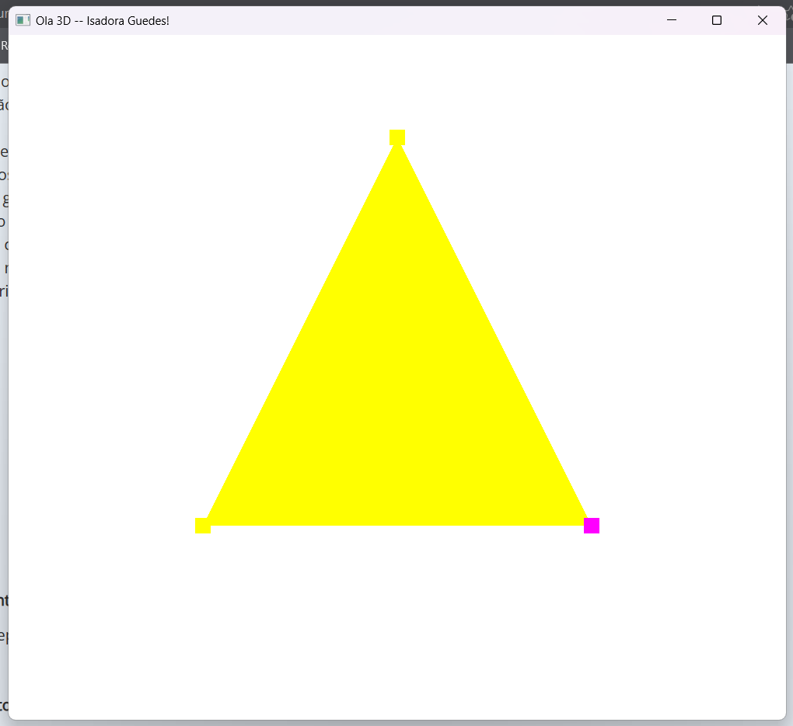

# Computação Gráfica
Repositório com os projetos desenvolvidos para a cadeira de Computação Gráfica.

Autora: Isadora Soares Guedes

## Entrega do Módulo 1

- Entrega do repositório
- Projeto/Pasta: Hello3D
- Código alterado para exibição de "Isadora Guedes" no nome da janela

## Entrega do Módulo 2

- Adiciona operação de translação teclas WASD e IJ
- Adiciona operação escala teclas R e T
- Cria duas instâncias de cubo utilizando triângulos

## Entrega da Atividade Vicencial 1

- Adiciona leitura de arquivo .obj
- Adiciona leitura do arquivo suzanneTri.obj com cores fixas

## Entrega do Módulo 3

- Adiciona leitura do arquivo mtl
- Adiciona leitura com texturas
- Adiciona uso dos valores "vt" do arquivo .obj

## Entrega do Módulo 4

- Adiciona configuração de iluminação
- Adiciona uso dos valores "vn" do arquivo .obj

## Entrega do Módulo 5

- Adiciona movimentação da câmera através do mouse
- Adiciona movimentação da câmera através dos comandos wasd
- Cria Camera.cpp e Camera.h para separar o código

## Entrega do Módulo 6

- Adiciona trajetória do objeto através do método Bezier
- Trajetória circular pelos pontos definidos dentro do código

